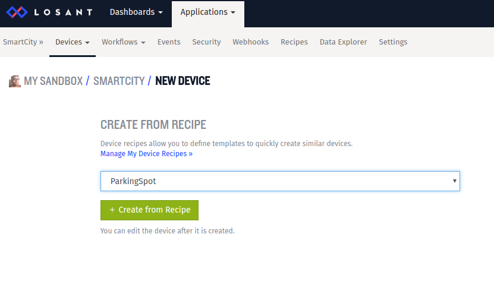

# Smart City

### Problem scenario
Availability of data helps us confidently make data-backed smart decisions in our day to day life. We commonly use a growing number of mobile apps to access data to make our life less stress-free and efficient. 

Parking space is a critical resource and therefore managing it is a key foundation of Smart City. Real-time data on parking status is a valuable information for us to make informed parking management decisions. Therefore there is an increasing demand for this information, both in the public space as well as private space. As the demand for data is on the rise, more and more city, university and transportation leaders are turning to smart parking and parking analytics. Parking is also one of the top revenue sources for city, followed by corporate and university campuses as largest users.

### Solution
In this example, we are going to build a Smart City Parking management system. It provides users with real time access to information on parking spots in the city. Useful information such as parking spot GPS locations on the city map, their availability for parking, and temperature and humidity conditions at the parking spot. So even though a parking spot is available, the conditions for parking may or may not be favorable. It could too hot or cold or wet to park, The temperature or humidity levels show if the spot is suitable for parking at that time of the day.

Instant access to all this information helps user make wise decisions in approaching or even reserving the parking spot. A mobile app can easily be developed as a front end for the solution, but for the sake of simplicity within the scope of this tutorial, we are going to use beautiful Losant dashboards. 

The dashboard provides real time view of the map along with the device attributes. It will also enable user to “Reserve” a parking spot based on his data-backed decision. This action can trigger a workflow that initiates parking meter for customer at that spot, billing the customer based on usage, and resetting it on payment. For now, we shall limit our scope to just issuing the “Reserve” command to keep it simple at this stage.


### IoTify’s Network Simulator
We are going to use IoTify’s powerful Network Simulator to simulate IoT network in minutes. The Network Simulator tool makes it easy to simulate a whole Smart City by quickly scaling up several emulated Smart Parking devices. Please go through the [Introducing Network Simulator](https://iotify.help/network/) to know more about this tool. 

A Smart Parking device is represented as a template in Network Simulator. [Signup at IoTify](http://www.iotify.io) using “SmartCity” as the Invitecode.  

Once, you sign in, we are going to create a template by defining the schema of the message of our Smart Parking device, scale it up to 5 devices and run the network simulation tool. But first, let us create an application in Losant and setup dashboard.


#### [1] Setting up Losant application :
[Losant](www.losant.com) is an IoT platform with various tools to manage IoT applications. We are going to use it to manage our simulated Parking Spot devices. If you don’t have an account at Losant, sign up [here](https://accounts.losant.com/create-account). 

#### Step 1: Create new application 
After logging in, click on the **Applications** tab in the upper menu and then **Create Application**. In the new application screen, choose a name for your application (for example “SmartCity”):


Click the **Create Application** button and you will be taken to the application home page. 

#### Step 2: Create a recipe for devices 
Our simulated Parking Spot devices will be defined in Losant by creating devices in the application. In order to facilitate the creation of multiple devices of the same type, Losant offers the possibility to create a recipe and instantiate devices from this recipe. 
a. In the *Devices* section of the application home page, click the **Add** button
b. In the *CREATE FROM RECIPE* section, click **Manage My Device Recipes** and then **Add Recipe**


c. Give a name to the recipe (from example, “ParkingSpot”) and select the option “Set my own default names, tags and attributes”. Click **Create Recipe** to create the recipe.


d. Define the device properties which will be used to visualize data coming from any of our simulated devices. In the *DEVICE TYPE* section, select Standalone
e. In the *DEVICE ATTRIBUTES* section, add the following attributes:
```s
“Location” with data type “GPS string” 
“Available” with data type “Number”
“Humidity” with datatype “Number”
“Temperature” with data type “Number”
```


f. Click **Save Recipe**.

Now we can create multiple devices taking this recipe as starting point.


#### Step 3: Create devices from recipe 

a. From the application homepage, select **Add Device** from the Devices drop down menu item, to add a new device. In the *CREATE FROM RECIPE* section select the recipe just created.


b. Click Create from Recipe
c. Set the *Device Name* to something unique (e.g. “ParkingSpot001”). Note the device ID displayed in the upper right part of the screen. It will be used later when simulating this Parking Spot device. 


d. Click **Save Device**. 

We just created the first device. Following the same procedure quickly create other devices; in this example, we are creating 5 devices, which will be visible in the application home screen:


#### Step 4: Create access key 

Device can only connect to this application by providing authentication credentials. In Losant, these credentials are defined in the form of an access key and a corresponding access secret. A given access key can be shared by more than one device; in our application we are going to create a single access key which will be used by all Parking Spot devices.

a. From the application home page, click on the Security tab and then click the **Add Access Key** button at the top right corner
b. In the key definition page, give a descriptive name to the key (for example, “Parking Spots”)
c. Select “All Devices” in the access restrictions section
Click **Create Access Key**; a popup widget will appear displaying the auto-generated key and secret


Make sure to copy at least the access secret (since it won’t be recoverable if you lose it), then select “I have copied my access key and secret to a safe place.” and click Close Window. The newly created access key is now ready to use.

#### [2] Set up a Losant dashboard 
Losant allows creating personalized dashboards to display data coming from any device in a given application, and also to send commands to a device. We are going to create a dashboard to monitor the status of the 5 Parking Spot devices we created in the previous steps. We are also going to provide an interface for user to make data-driven decisions and “Reserve” a parking spot of his preference.
#### Step 1: Create Dashboard 
a. Click the **Dashboards** item in the top menu in the home page of your Losant account
b. Click **Create Dashboard**
c. Choose a name for your dashboard, for example “Parking Spot”


d. Click **Create Dashboard** at the bottom of the page. 

Now it’s time to define the contents of the dashboard. Since our Parking Spot devices will be sending location and garbage level data, we are going to display a map with the location of each parking spots, their availability status and the Humidity and Temperature conditions. We will also add Indication widget to displays status of all parking spots, and buttons to allow user to reserve the desired parking spot.

#### Step 2: Add a map 

To add the map- 
a. From the Dashboard, click **Add Block** 
b. From the widgets screen, click Customize in the *GPS HISTORY* block and you will be taken to the block definition screen


c. Select the *ParkingSpot* application
d. In the Duration drop-down menu, select “Last received data point” (we don’t need to track the location history, because we are interested only in the latest status of the parking spots.)
e. In the “Device IDs/Tags” drop-down menu, select “DeviceRecipe=ParkingSpot”
f. In the Attribute drop-down menu select “location”, so that the map will display the location of all devices created from our recipe


g. Under “POINT DISPLAY CONFIGURATION” we will show a green location indicator if parking spot is available, if not we will show it as Red. 
h. Click on *Advanced* and edit the template to this -
```sh
{{#if data.available}}
{{colorMarker '#ff261b'}}
{{else}}
{{colorMarker '#8db319'}}
{{/if}}
```
The above expression will show the map point display in Green color when the value of data.available is 1, indicating that the Parking Spot is available. And in Red color when the value is 0, indicating that it is unavailable.


i. A Losant map can also show in a popup widget additional information on a device when clicking on it. We are going to use this feature to visualize the identifier of each Parking Spot, its location, availability status and the Humidity and Temperature conditions. In the Popup Template text box, write the following text:
```sh
Parking at {{format deviceName}}  ({{format latitude}}, {{format longitude}}) is
{{#if data.available}}
available
{{else}}
unavailable.
{{/if}}
```
The Humidity is ```{{format data.humidity}}``` and Temperature is ``` {{format data.temperature}}```

j. Click **Add Block** to add the map to the dashboard.

#### Step 3: Add Indicator blocks to indicate parking spot status 
We are going to add Indicator blocks to indicate the parking status of all the parking spot devices. 

a. Click **Add Block**, locate the INDICATOR block in the list of widgets and click its Customize button.
b. Select the “SmartCity” application. 
c. In the Duration drop-down menu select “Last received data point”. 
d. Under “Block Data” section, in “Query 0” section, select “ParkingSpot001” as the Device ID and “available” as the Attribute. Note the value variable “value-0”. We will use this to set conditions.
e. We will use conditions to change the color and message depending on the query above, i.e. the availability status of the ParkingSpot001 device that we set above.
f. Click on **Add Condition** . For the ‘available’ condition, we will use the expression ```“{{value-0}} == 1”``` and set the set the label as “Parking Spot 001 is available. Hurry!.” Set the color of the indicator for this condition to Green ```(#ff261b)```.
g. Click on **Add Condition**. For the ‘unavailable’ condition, we will use the expression ```“{{value-0}} == 0”``` and set the set the label as “Parking Spot 001 is unavailable for now.” Set the color of the indicator for this condition to Red ```(#8db319)```.


This adds an Indicator for the “ParkingSpot001” device to our dashboard. Repeat the steps above to add similar Indicators for the other 4 Parking Spots. 

#### Step 4: Add Button blocks to Reserve a Parking Spot 
We are going to add buttons to enable user to reserve parking spot. On Clicking the button sends “Reserve” command. Let us add these buttons.
a. Click **Add Block**, locate the INPUT CONTROLS BLOCK in the list of widgets and click on the Customize button
b. Select the “SmartCity” application and enter Block header text as “Reserve my spot”
c. Under “Configure Block” section, click “Add Control” drop down and select “Button trigger” to add a Button block
d. Enter Label as “Reserve Parking Spot 001” and select color Blue for this button
e. Make sure you have selected “Send Device Command” under the “On Click…” setting.
f. Select the Device ID “ParkingSpot001” 
g. Enter Command name as “Reserve”. This is the command name that will be sent when user clicks on the “Reserve Parking Spot 001” button.


This adds a Button block for reserving Parking Spot 001. Similarly add buttons for the other 4 parking spots.

This completes the creation and setting up of our Parking Spot Dashboard in Losant. Don’t worry if you do not see much happening at this stage. Next, we are going to use IoTify’s Network Simulation tool to start sending traffic this way.

#### [3] Setting up Network Simulator templates 
But first, we need to create templates for each of the Parking Spot devices.
#### Step 1. Create new templates for each devices 
a. Click on **Create a new Template** in IoTIFY network simulator
b. Enter a unique name to the template, say “Parking001”
c. Select MQTT as network connection type
d. Select mqtt (TCP) as protocol
e. Insert “broker.losant.com” as endpoint URL
f. In the ClientID text box, insert the device ID that has been assigned to the first device you created (the device ID is displayed in the upper right corner in the Losant webpage that lists the device properties)


g. Under “Provide Credentials” section, enter the username and password as generated at the time of creating access key for our Losant application


h. Under “Specify Message Contents” section
i. Select the topic as “losant/<Device ID of ParkingSpot001 in Losant>/state”, e.g. “losant/58c931343cc88e00018edfba/state”
ii. In the “Message Contents” section, enable JSON and insert the following JSON:
```sh
{
  "time" : { "$date" : "{{moment.now()}}" },
  "data" : {
	"location": "47.369799, 8.537535",
	"humidity": "{{last.data ? (chance.integer({min:30, max:99})) : 0}}",
	"temperature": "{{last.data ? (chance.integer({min:30, max:99})) : 0}}",
	"available": "{{last.data ? (last.data.available) : 1}}"
 		}
}
```
iii. The default value of “available” key is set to “1”. Indicating that it is available. Value of “0” indicates “unavailable” and is treated accordingly in the Losant Dashboard blocks.
iv. Enable “Subscription” 
v. Insert the “Subscription Topic” as 
“losant/<Device ID of ParkingSpot001 in Losant>/command”
e.g. “losant/58c931343cc88e00018edfba/command” 
vi. Insert the following “Custom Handler function”:
```sh
{
	var cmd_name = JSON.parse(message).name;
	if (cmd_name == 'Reserve')
    			last.data.available = 0;
}
```


vii. Click “Save” to click the Template
This creates the template for device Parking001. Similarly create templates for the other 4 devices with the following changes only - 
a. Change template names to “Parking002”, “Parking003”, “Parking004” and Parking005” respectively
b. Change the ClientIDs with the corresponding Device IDs from Losant
c. Topic and Subscript Topic with the correct Device Ids
d. The location value in “Message Content” with “47.3758, 8.53853”,  “47.3778, 8.54553” , “47.3712, 8.53153” and “47.3658, 8.53654” for “Parking002”, “Parking003”, “Parking004” and Parking005” templates respectively.
e. Set the value of the key “availability” for “Parking003” to 1, indicating it is available for reserve, and that of “Parking002”, “Parking004” and “Parking005” to 0, indicating these are unavailable for parking. 
This will create the 5 templates for the 5 Parking Spot devices.

#### Step 2. Run the Network Simulator 
To run the Network Simulator :
a. Click on **Network** link in the top bar
b. Click **Simulate**. 
c. Chose the template from the drop down. Select “Parking001”
d. Make sure Number of Clients is set to 1, to be able to work with our Losant application
e. Click **Start Generation**


This will open the “Jobs” page where it lists all the simulation jobs along with their Progress. Parking001 will be shown in the list as “pending” and then changed to “running” as the simulation start. 

Similarly, simulate the other 4 devices by selecting the respective templates and clicking on “Start Generation” button.


#### [4] Seeing it work in action 

Now head over to the Losant Dashboard. 


Let us try to explore and check the values -
a. Parking Spots 001 and Parking Spot 003 are shown in Green color, as “available”, since we set the value for the availability attribute to 1 for both those Parking Spots. While, Parking Spot 002, Parking Spot 004 and Parking Spot 005 appear in Red color as we set the availability for those devices to 0.
b. All Indicators display the status of the availability of Parking Spots with the appropriate color.
c. Click on any Parking Spot in the map. It will display the following info -
Parking at ParkingSpot005 (47.3658, 8.53654) is unavailable. The Humidity is 47 and Temperature is 32


d. Let us try to reserve the Parking Spot 003, which is available for parking
i. Click the **Reserve Parking Spot 003** button
ii. The Indicator will change from “Parking Spot 003 is available. Hurry!” to “Parking Spot 003 is unavailable for now”, confirming that the spot has been reserved. 
iii. The color of the “Parking Spot 003” point on the map changes from Green to Red.
iv. Clicking on the point displays that it is unavailable.


Finding a vacant parking spot in the morning should not be so stressful anymore.

*Tell us what would you like to build with the help of IoTify?*


