# Smart City simulation

### Problem scenario
Globally, the stride of migration in infrastructure is transforming a growing number of cities into Smart Cities by deploying several IoT solutions. We commonly use a growing number of mobile apps to access data to make our life stress-free and efficient. The enhanced quality of life in a Smart City is attracting huge investments and public private commitments. 

However, increasing demand in intelligent infrastructure poses its own challenges. Infrastructure has a profound effect on our day to day life, which puts great pressure on the quality of success of such projects. Failure of Smart City projects can cause huge financial losses and widespread public distress from incidences such as getting stuck in traffic jams or living in prolonged power blackouts, or having trash cans overflowing with garbage, etc. 

Smart City is a reality and as the number of connected device increase exponentially, these challenges need to be taken head on. Things like buses, trash cans, energy meters, parking lots, buildings, homes and streetlights to name a few, are getting connected in a large network and emitting data for systems to consume and make intelligent day to day decisions. 

Creating such large network of smart devices is one of the core challenges of IoT.  High success rates of these solutions is creating a high demand and opportunities for innovative IoT solutions. Consequently, there is a huge demand for IoT professionals across the world. 

### Solution

**IoTify’s powerful Network Simulation** tool can simulate network in minutes. The network simulator can easily simulate any type of device once it is created on the IoTify server. The Network Simulator tool makes it easy to simulate a whole Smart City by quickly scaling up several emulated IoT devices. Please go through the [Introducing Network Simulator](https://iotify.help/network/) to know more about this tool. 

A device is represented as a [template](https://iotify.help/templates/) in Network Simulator. [Signup at IoTify](https://iotify.io/?Invitecode=SmartCity) using “SmartCity” as the Invitecode to simulate this Smart City within minutes.  Once, you sign in, we are going to create the following templates by defining the schema of the message that each of these device emit: 

1. **Smart Trash can** : Smart City Smart Waste management system is one of the critical enabler for automating garbage disposal and keeping the streets clean. It is one of the fundamental service provided by  the local municipality. 
2. **Smart Parking spot** : Smart City Parking management system provides users with real time access to information on parking spots in the city. Useful information such as parking spot GPS locations on the city map, their availability for parking, and temperature and humidity conditions at the parking spot. So even though a parking spot is available, the conditions for parking may or may not be favorable. It could too hot or cold or wet to park, The temperature or humidity levels show if the spot is suitable for parking at that time of the day.
3. **Smart Street light** : Street lights lined up along streets across city consume significant energy. A Smart street light works efficiently and conserves energy by switching it’s status depending on the surrounding light conditions. 
4. **Smart Traffic signal** : No one likes to wait at the traffic signal. Smart Traffic signal is a crucial component of Smart City as traffic signals dot all across city and provide valuable information on city conditions. In addition to traffic management, a Smart Traffic signal also sends data on environment status, viz, the pollution and noise level at the traffic signal. When all data from all Smart Traffic signals is analyzed, it present the health status of the Smart City and drive significant strategic imperatives for the local governing bodies.
5. **Smart Transportation** : Majority of citizen’s day to day life depends on city transportation system. Public and private transportation is the key mode of commuting and logistics and form the backbone of city’s infrastructure. For a city to work efficiently without breaking down, the transportation system needs to be integrated and managed through proper asset management. A Smart transportation system helps address some of these key issues.  Our simple Smart Transportation solution enhances the quality of citizen’s day to day life by helping them make data-driven decisions based on the information sent by the devices. Such a device can be installed in city bus to make efficient public road transportation :


For the sake of simplicity, all our devices are going to publish their status to the public iot.eclipse.org:1883 MQTT broker. 

Once we create these templates and run the IoTify Network Simulator to simulate our Smart City, we will use a simple MQTT client called *MQTTLens* to inspect the data our Smart City emits. MQTTLens can be installed as a Chrome extension from Chrome web store.


#### Step 1: Installing MQTTLens 
Let us install MQTTLens. In Chrome, you can install it as an extension by simply searching for it in the Chrome webstore at https://chrome.google.com/webstore/category/extensions?hl=en-US
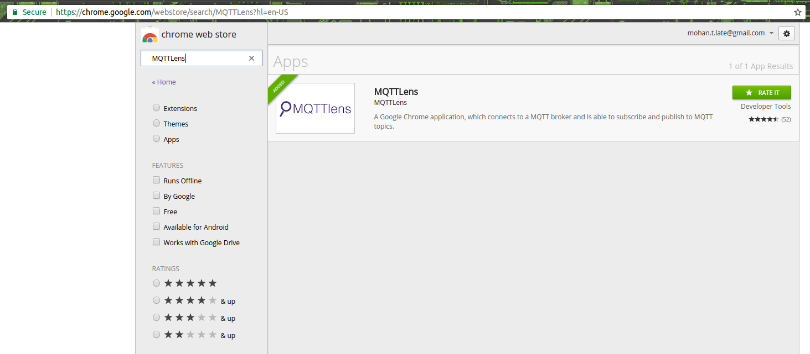
Once installed, we will create connections for each of the device to make things simple. To create a new connection in MQTTLens:
1. Add a new connection by clicking on the “+” sign
2. Set the Connection name to something like “IoTify Smart City Smart Trash Can”. It will look something like “lens_IxgG1bGRMgW0L0XHTvNyT6mAzNR”
3. Set the hostname to “iot.eclipse.org”
4. Click on Generate a Random ID to generate and set a random Client ID. Note this id as we will be using this Client ID in our Smart Trash can template later.
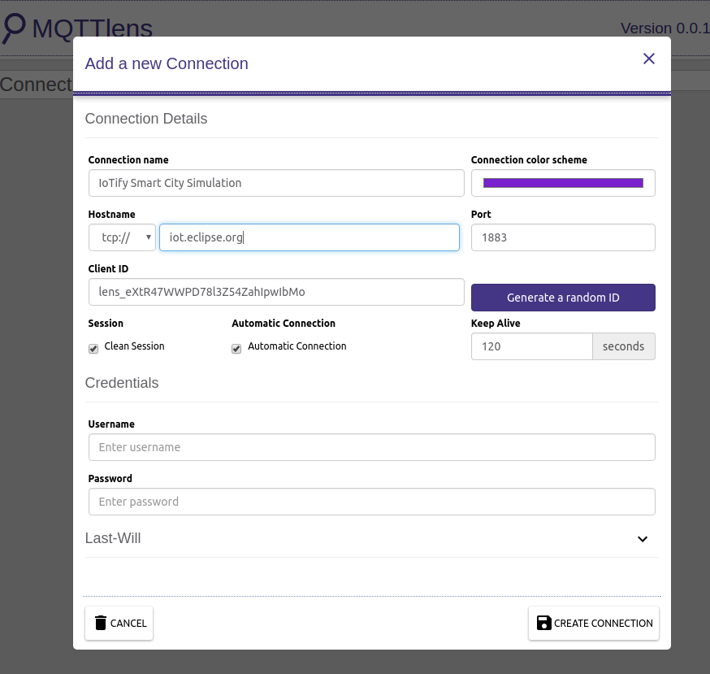

Similarly create 4 more connections for the 4 other devices and call it, say, “IoTify Smart City Smart Parking ”, “IoTify Smart Street Light”, “IoTify Smart Traffic Signal” and “IoTify Smart City Transportation” respectively and note their Client IDs.

Let us simulate the Smart City by first creating templates for each of the 5 devices using IoTify Network Simulator tool .
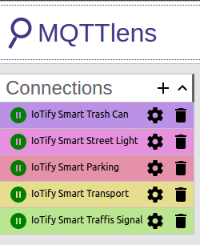


**Step 2: Create Smart Trash Can template**

Smart trash are spread all over Smart city, each emits the following status -
1. GPS location
2. Level of trash in the trash can

To create a device in Network Simulator:
1. Click *Network->Templates* 
2. Set a unique name to the trash can, say “SmartTrashCan001”
3. Chose MQTT as the network connection type and MQTT as the protocol
4. Enter “iot.eclipse.org” as the Endpoint URL
5. Set the ClientID with the one generated at the time of creating connection in MQTTLens. 
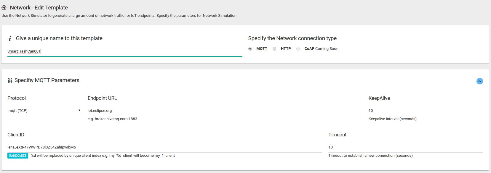
6. Under Specify Message Contents:
Set the Topic to something like ```smartcity/<clientID>/smarttrashcan001/state```
e.g. ``` smartcity/lens_5qfRXGLmMGhg6tWRxGnT90EsRxI/smarttrashcan001/state ```
7. Enable JSON
8. Put the message content in JSON format as :
```sh
{
  "time" : { "$date" : "{{moment.now()}}" },
  "data" : {
    "location": "47.363961, 8.535817",
    "level": "{{last.data ? (chance.integer({min:0, max:100}) : 50}}"
  }
}
```
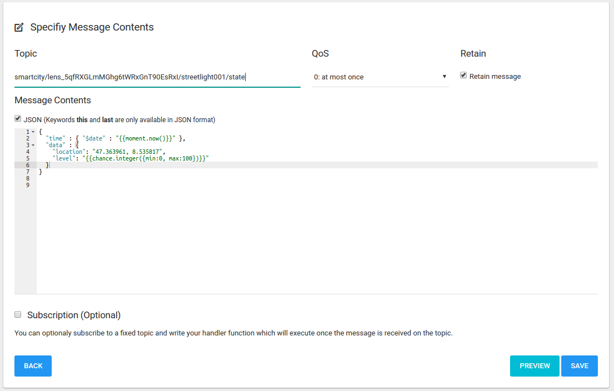
9. Click **Save** and you just created a *Smart Trash* can device template

You can easily scale up the number of Smart Trash cans like this. Just change the Topic so that each is unique.


**Step 3: Create Smart Parking spot template**
Smart Parking spot devices are located all over cities in public as well as private lots. A typical Smart Parking spot device sends the following message parameters:
1. GPS location of the parking spot
2. Availability of parking
3. Humidity at the parking spot
4. Temperature at the parking spot

To create a device in Network Simulator:
1. Click *Network->Templates* 
2. Set a unique name to the trash can, say “SmartParking001”
3. Chose MQTT as the network connection type and MQTT as the protocol
4. Enter “iot.eclipse.org” as the Endpoint URL
5. Set the ClientID with the one generated at the time of creating connection in MQTTLens. 
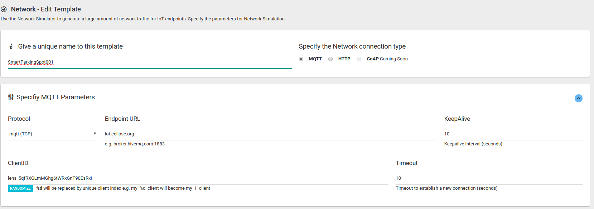
6. Under Specify Message Contents:
Set the Topic to something like ``` smartcity/<clientID>/smartparking001/state ```
e.g. ``` smartcity/lens_9qfRXGLmMGhg6tWRxGnT90EsQx/smartparking001/state ```    
7. Enable JSON. Put the message content in JSON format as :
```sh
{
  "time" : { "$date" : "{{moment.now()}}" },
  "data" : {
    "location": "47.369799, 8.537535",
    "humidity": "{{last.data ? (chance.integer({min:30, max:99})) : 0}}",
    "temperature": "{{last.data ? (chance.integer({min:30, max:99})) : 0}}",
    "available": "{{last.data ? (last.data.available) : 1}}"
  }
}
```
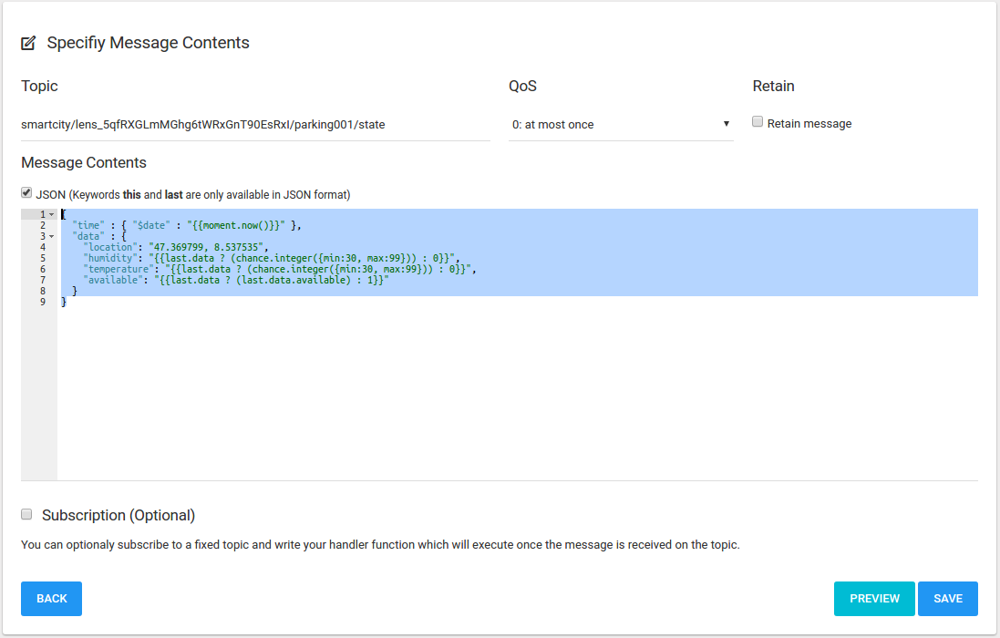
8. Click **Save** to create the *Smart Parking Spot* template.

**Step 4: Create Smart Street light template**
A Smart Street light sends the following information:
1. GPS location of the street light
2. Ambient light condition
3. Energy consumption
4. Its own lamp status

To create a device in Network Simulator:
1. Click *Network->Templates* 
2. Set a unique name to the trash can, say “SmartStreetLight001”
3. Chose MQTT as the network connection type and MQTT as the protocol
4. Enter “iot.eclipse.org” as the Endpoint URL
5. Set the ClientID with the one generated at the time of creating connection in MQTTLens. 
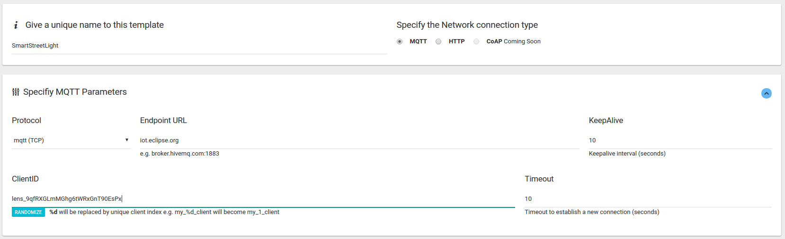
6. Under Specify Message Contents, set the Topic to something like ``` smartcity/<clientID>/smartstreetlight001/state ```
e.g. ``` smartcity/lens_7qfRXGLmMGhg6tWRxGnT90EsPx/smartstreetlight001/state ```
7. Enable JSON. Put the message content in JSON format as :
```sh
{
  "time" : { "$date" : "{{moment.now()}}" },
  "data" : {
    "location": "47.365202, 8.538435",
    "ambientLight": "{{chance.integer({min:0, max: 100}}}",
    "lampStatus" : "{{chance.integer({min:0, max: 1}}}",
    "energyConsumption" : "{{chance.integer({min:0, max: 100}}}"
  }
}
```
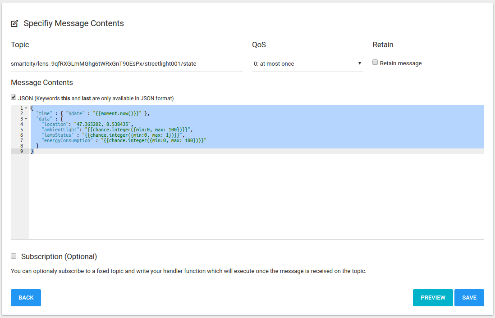
8. Click **Save** to create the *Smart Street light* template.

**Step 5: Create Smart Traffic signal template**
A Smart Traffic signal sends the following attributes:
1. GPS location of the traffic signal
2. Traffic level
3. Signal status
4. Energy consumption
5. Noise level
6. Pollution level


To create a device in Network Simulator:
1. Click *Network->Templates* 
2. Set a unique name to the trash can, say “SmartTrafficSignalt001”
3. Chose MQTT as the network connection type and MQTT as the protocol
4. Enter “iot.eclipse.org” as the Endpoint URL
5. Set the ClientID with the one generated at the time of creating connection in MQTTLens. 
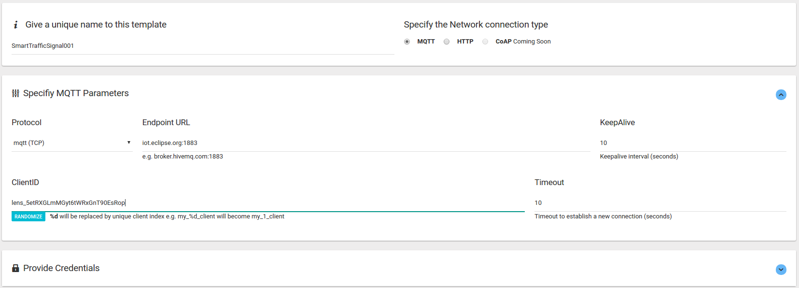
6. Under Specify Message Contents, set the Topic to something like
 ```smartcity/<clientID>/smarttrafficsignal001/state```
e.g. ```smartcity/lens_5etRXGLmMGyt6tWRxGnT90EsRop/smarttrafficsignal001/state```
7. Enable JSON. Put the message content in JSON format as :
```sh
{
  "time" : { "$date" : "{{moment.now()}}" },
  "data" : {
    "location": "47.365312, 8.538335",
    "trafficLevel": "{{chance.integer({min:0, max: 100}}}",
    "currentStatus" : "{{chance.integer({min:1, max: 3}}}",
    "noiseLevel": "{{chance.integer({min:0, max: 100}}}",
    "pollutionLevel": "{{chance.integer({min:0, max: 100}}}",
    "energyConsumption" : "{{chance.integer({min:0, max: 100}}}"
  }
}
```
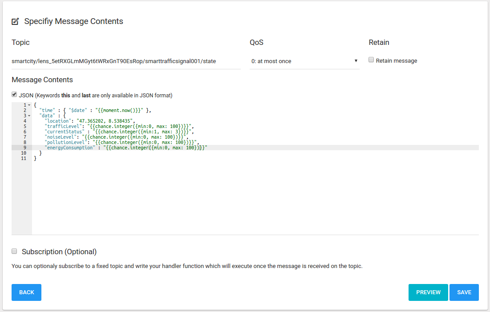
8. Click **Save** to create the *Smart Traffic Signal* template.

**Step 6: Create Smart Transportation template**
A Smart Transportation device sends the following data:
1. Bus number
2. GPS location of the transport
3. Seats available in the bus
4. Estimated Time to Arrival at the next bus stop on the route
5. Fuel consumption

To create a device in Network Simulator:
1. Click *Network->Templates* 
2. Set a unique name to the trash can, say “SmartTransport001”
3. Chose MQTT as the network connection type and MQTT as the protocol
4. Enter “iot.eclipse.org” as the Endpoint URL
5. Set the ClientID with the one generated at the time of creating connection in MQTTLens. 
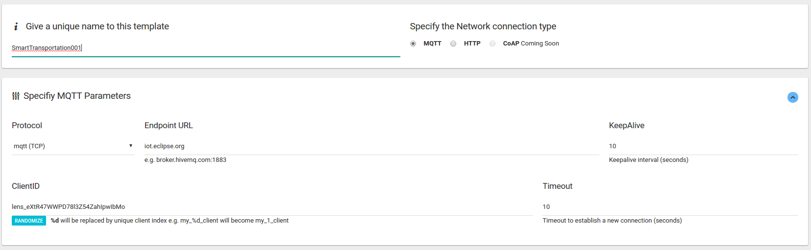
6. Under Specify Message Contents, set the Topic to something like
 ```smartcity/<clientID>/smarttransport001/state```
e.g. ```smartcity/lens_5etRXGLmMGyt6tWRxGnT90EsRop/smarttransport001/state```
7. Enable JSON. Put the message content in JSON format as :
```sh
{
  "time" : { "$date" : "{{moment.now()}}" },
  "data" : {
    "location": "47.365202, 8.538435",
    "busNumber": "{{chance.integer({min:100, max: 999})}}",
    "seatsAvailable": "{{chance.integer({min:0, max: 100})}}",
    "eta" : "{{chance.integer({min:0, max: 10})}}",
    "fuelConsumption" : "{{chance.integer({min:0, max: 100})}}"
  }
}
```
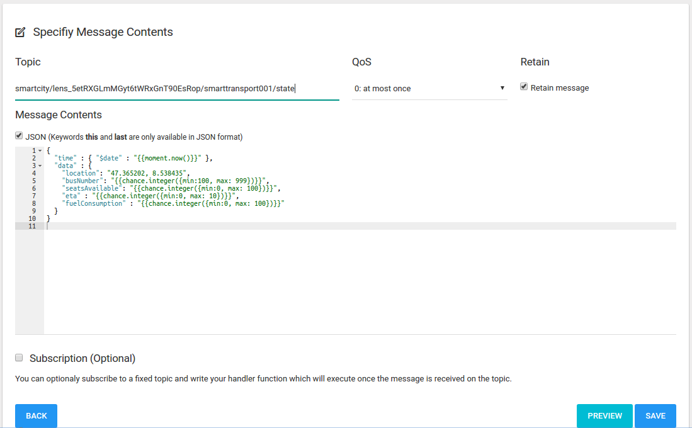
8. Click **Save** to create the *Smart Transportation* template.

**Step 7: Run the Network Simulator**
Now that we have all our templates ready, we are going to simulate Smart City by simulating all these devices. This creates the exact real life use case condition where all these devices are publishing their status in real time. A mobile app can be developed to aggregate data and present in articulated form to make meaningful decisions. For the sake of simplicity, we will use a simple MQTT client called MQTTLens. 

But first, let us simulate our Smart City using the powerful Network Simulator.
1. Click on **Network** item in the top menu bar
2. Click on **Simulate** 
3. One by one select the templates that we created above and click Start Generation to simulate the Smart City.
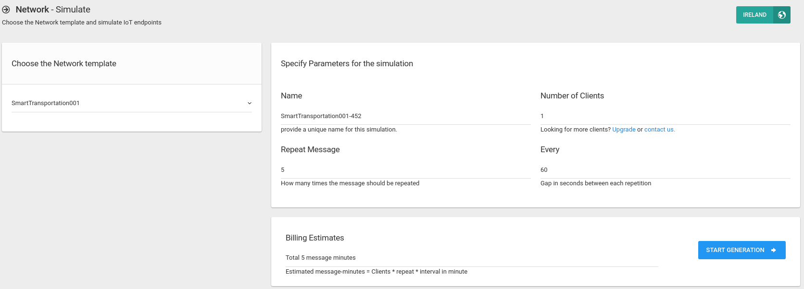

**Step 8: Visualizing Smart City data**
To visualize the data sent by our Smart City network, we are going to subscribe to all the 5 topics in MQTTLens as so -
1. Select the Connection, say, **IoTify Smart Street Light**
2. Under *Subscribe*, enter the topic as set in the **SmartStreetLight001** template and click Subscribe button

Messages will start appearing in the lower part of the window:
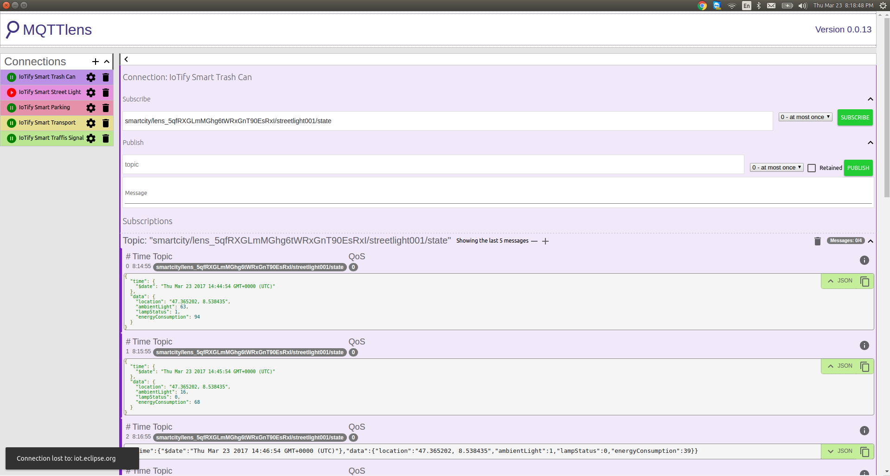

Similarly, for each of the connections, enter the corresponding topic and subscribe to visualize data from the *Smart City Simulation*

*Tell us what would you like to simulate with the use of **IoTify Network Simulator?***
